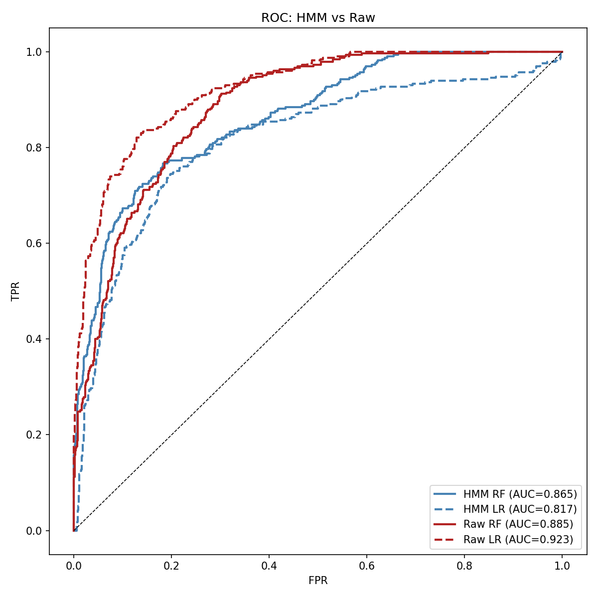
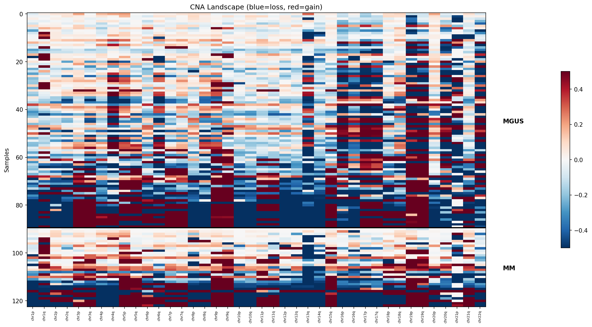
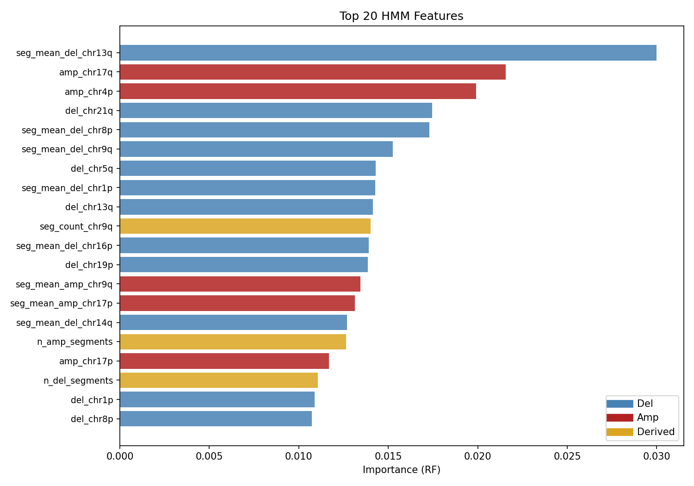
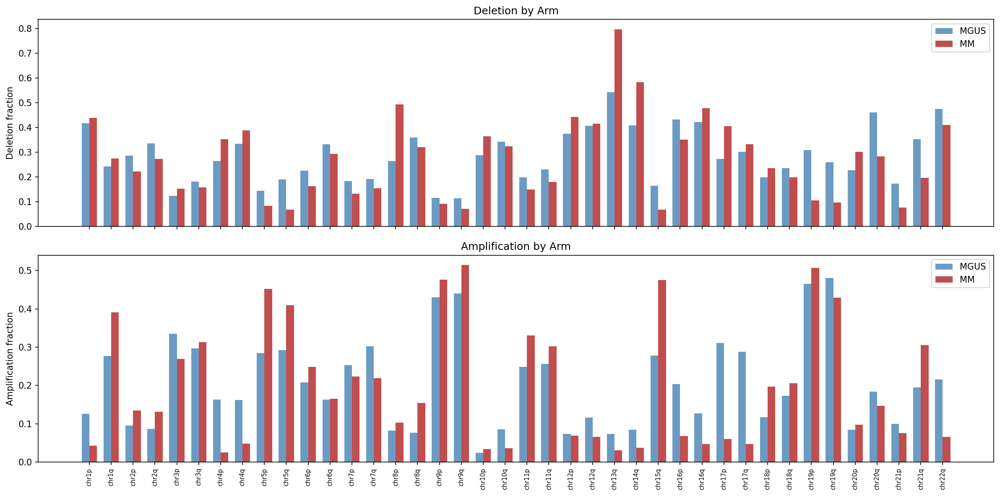

# HMM-Based Copy Number Classification: MGUS vs Multiple Myeloma

**MA770 Final Project** — Evan Dugas & Fred Choi

## Question

Does cleaning up genomic noise with a Hidden Markov Model produce better features for predicting cancer stage (MGUS vs MM) than using the raw copy number signal directly?

## Approach

We built a **cohort-trained Gaussian HMM** to segment probe-level aCGH copy number data into deletion, neutral, and amplification states, then compared arm-level features derived from HMM segmentation against raw log2 ratio summary statistics for MGUS/MM classification.

### Key Methods
- **Data**: GSE77975 — 123 samples (90 MGUS + 33 MM) across 4 Agilent aCGH platforms
- **HMM**: BIC-selected 5-state model trained on ~2M probes from the full cohort, with per-sample transition fitting and Viterbi decoding
- **Features**: HMM arm fractions + CNA burden + segment counts (204 features) vs Raw mean + SD per arm (80 features)
- **Classification**: Random Forest + Logistic Regression L1, 5x10 repeated stratified CV
- **Statistics**: Wilcoxon rank-sum per arm with Benjamini-Hochberg correction; paired t-test comparing feature sets

## Results

| Feature Set | Model | AUC | F1 | Balanced Accuracy |
|-------------|-------|-----|-----|-------------------|
| HMM | RF | 0.882 | **0.592** | **0.719** |
| HMM | LR | 0.854 | 0.661 | 0.768 |
| Raw | RF | 0.884 | 0.512 | 0.678 |
| Raw | LR | **0.926** | **0.743** | **0.822** |

**HMM vs Raw (RF)**: AUC virtually identical (0.882 vs 0.884, p=0.85). HMM significantly better on F1 (0.592 vs 0.512, p=0.034) and balanced accuracy (0.719 vs 0.678, p=0.034).

**Significant CNA regions** (Wilcoxon, q < 0.05): chr13q, chr14q, chr8p, chr1p, chr4p — all known MM-associated deletions.

### Figures

| | |
|---|---|
|  |  |
| ROC curves: HMM vs Raw | CNA landscape: MGUS (top) vs MM (bottom) |
|  |  |
| Top 20 HMM features | Per-arm CNA: MGUS vs MM |

## Conclusion

HMM segmentation achieves **equivalent AUC** to raw features (0.882 vs 0.884, p=0.85) and **significantly better F1 and balanced accuracy** (p=0.034), indicating that HMM-derived structural features (segment counts, CNA burden) improve classification decisions for the minority MM class. The cohort-trained approach with BIC model selection produces biologically correct segmentation across samples from different array platforms. Segment count normalization by probe density was critical to remove platform-related confounds.

## Setup

```bash
# Install dependencies
pip install numpy pandas scikit-learn scipy statsmodels hmmlearn matplotlib

# Download and process data
bash pipeline/00_download.sh
python pipeline/01_sort_samples.py
python pipeline/05_process.py
python pipeline/06_classify.py
```

## Pipeline

```
00_download.sh       Download GSE77975 from GEO
01_sort_samples.py   Sort samples into MGUS/MM/excluded (all 4 platforms)
02_genomic_bins.py   Genomic bin utilities (library)
03_parsers.py        Agilent aCGH file parser (library)
04_hmm_core.py       BIC selection + cohort-trained HMM
05_process.py        Parse → HMM segmentation → feature extraction
06_classify.py       Classification + statistical tests + plots
```

## References

1. Mikulasova A et al. (2016). Genomewide profiling of copy-number alteration in MGUS. *Eur J Haematol*. [DOI: 10.1111/ejh.12774](https://doi.org/10.1111/ejh.12774)
2. Colella S et al. (2007). QuantiSNP: an Objective Bayes HMM to detect and map CNV. *Nucleic Acids Res*. [DOI: 10.1093/nar/gkm076](https://doi.org/10.1093/nar/gkm076)
3. Aktas Samur A et al. (2019). Deciphering the chronology of copy number alterations in MM. *Blood Cancer J*. [DOI: 10.1038/s41408-019-0199-3](https://doi.org/10.1038/s41408-019-0199-3)
