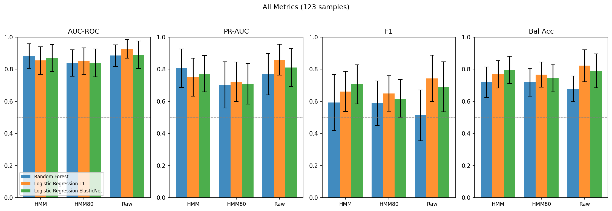
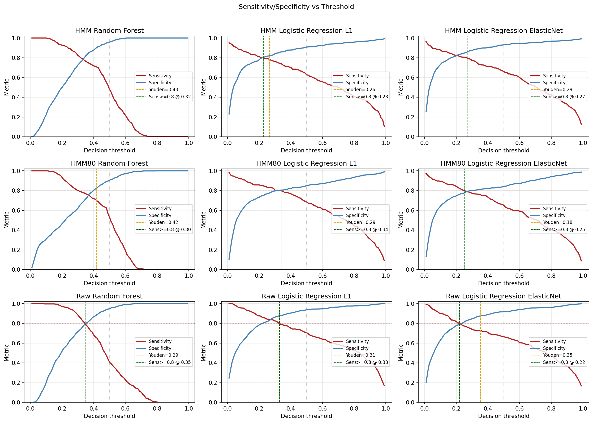
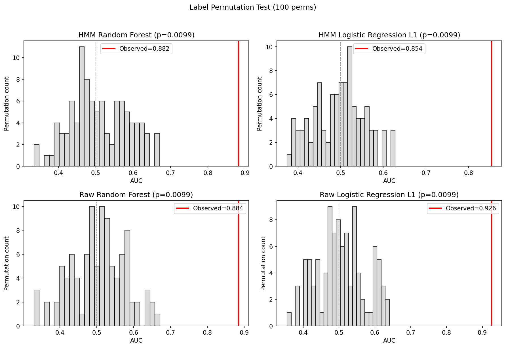

# HMM-Based Copy Number Classification: MGUS vs Multiple Myeloma

**MA770 Final Project** — Evan Dugas & Fred Choi

## Question

Does cleaning up genomic noise with a Hidden Markov Model produce better features for predicting cancer stage (MGUS vs MM) than using the raw copy number signal directly?

## Approach

We built a **cohort-trained Gaussian HMM** to segment probe-level aCGH copy number data into discrete copy-number states, then compared arm-level features derived from HMM segmentation against raw log2 ratio summary statistics for MGUS/MM classification.

### Methods
- **Data**: GSE77975 — 123 samples (90 MGUS + 33 MM) across 4 Agilent aCGH platforms
- **HMM**: BIC-selected 5-state model (selected 50/50 folds in fold-wise BIC); per-sample transition fitting; Viterbi decoding
- **Feature sets**:
  - **HMM (204)**: del / amp fractions, segment counts, per-segment means per arm, genome-wide CNA burden
  - **HMM-80 (matched)**: del + amp fractions only (80 features, matched to Raw)
  - **Raw (80)**: mean + SD of log2R per arm
- **Classifiers**: Random Forest, Logistic Regression L1 (Lasso), Logistic Regression Elastic Net (l1_ratio = 0.5) with 5×10 repeated stratified CV
- **QC**: DLRS, permutation test, bootstrap CIs, platform confound analysis, ComBat sensitivity, operating-point analysis
- **Leakage control**: fold-wise HMM retraining (including per-fold BIC state selection)

## Quality Control

- **DLRS (Derivative Log Ratio Spread)**: all 123 samples below 0.15 (threshold 0.3) — no arrays excluded
- **Label permutation test (100 perms)**: all configs **p = 0.0099** (0/100 null runs ≥ observed AUC) → signal is real
- **Per-fold BIC state selection**: **50/50 folds selected 5 states** → state choice is stable, not leakage-sensitive
- **Bootstrap 95% CIs** (1000 resamples): tight bands on AUC (~0.03 width)
- **Platform confound**: full cohort is confounded (all 90 MGUS on GPL11358, MM split across 4 platforms) — sensitivity analyses below

## Primary Results (leakage-free, fold-wise HMM retraining)

| Feature set | Model | AUC | PR-AUC | F1 | BalAcc | Sens | Spec |
|---|---|---|---|---|---|---|---|
| **HMM** | **RF** | **0.909 ± 0.071** | **0.840** | 0.606 | 0.727 | 0.485 | 0.969 |
| HMM | LR-L1 | 0.836 ± 0.085 | 0.744 | 0.638 | 0.755 | 0.606 | 0.906 |
| HMM | LR-EN | 0.839 ± 0.082 | 0.747 | 0.660 | 0.766 | 0.615 | 0.918 |
| Raw | RF | 0.884 ± 0.067 | 0.769 | 0.512 | 0.678 | 0.406 | 0.948 |
| **Raw** | **LR-L1** | **0.926 ± 0.058** | **0.859** | 0.743 | 0.822 | 0.706 | 0.938 |
| Raw | LR-EN | 0.889 ± 0.085 | 0.810 | 0.691 | 0.790 | 0.664 | 0.918 |

### HMM vs Raw (paired, 50 CV folds)

| Model | Metric | Winner | Δ | p |
|---|---|---|---|---|
| RF | AUC | HMM | +0.025 | 0.031 * |
| RF | PR-AUC | HMM | +0.071 | 0.001 ** |
| RF | F1 | HMM | +0.094 | 0.003 ** |
| RF | BalAcc | HMM | +0.050 | 0.003 ** |
| LR-L1 | AUC | Raw | −0.089 | <0.001 *** |
| LR-L1 | PR-AUC | Raw | −0.115 | <0.001 *** |
| LR-L1 | F1 | Raw | −0.105 | <0.001 *** |
| LR-L1 | BalAcc | Raw | −0.067 | <0.001 *** |
| LR-EN | AUC | Raw | −0.050 | <0.001 *** |
| LR-EN | PR-AUC | Raw | −0.064 | 0.001 ** |
| LR-EN | F1 | Raw | −0.031 | 0.22 ns |
| LR-EN | BalAcc | Raw | −0.024 | 0.15 ns |

**Classifier-dependent finding**:
- **Tree models (RF)**: HMM features win on all four metrics with statistical significance. Segment counts, CNA burden, and per-segment means give RF discrete structural cues that raw intensity statistics can't provide.
- **Linear models (LR-L1, LR-EN)**: Raw features win overall. L1 shows the largest gap; elastic net closes the F1/BalAcc gap to non-significance but still loses on the ranking metrics (AUC/PR-AUC).

## Matched feature count (HMM-80 vs Raw)

To rule out "HMM just has more features", we built HMM-80: only `del_{arm}` + `amp_{arm}` (80 features, matched to Raw). Full-cohort results:

| Model | HMM (204) AUC | HMM-80 AUC | Raw (80) AUC |
|---|---|---|---|
| RF | 0.882 | 0.839 | 0.884 |
| LR-L1 | 0.854 | 0.850 | 0.926 |
| LR-EN | 0.870 | 0.839 | 0.889 |

**HMM-80 drops below HMM-204** on all classifiers. The extra 124 features (segment counts, segment means, CNA burden) are **genuinely informative**, not redundant. At matched feature count, Raw beats HMM on every classifier — the "HMM-RF" advantage is driven by the extra structural features, not by having more columns.

## Operating-point analysis (full cohort)

Default threshold 0.5 misses many MM cases (sensitivity often < 0.7). Using Youden's J max or a sensitivity ≥ 0.80 constraint gives better clinical operating points:

| Config | Threshold rule | Thr | Sens | Spec | F1 | BalAcc |
|---|---|---|---|---|---|---|
| Raw LR-L1 | default | 0.500 | 0.706 | 0.938 | 0.753 | 0.822 |
| Raw LR-L1 | **Youden's J** | 0.313 | **0.821** | **0.872** | 0.757 | **0.847** |
| Raw LR-L1 | Sens ≥ 0.80 | 0.329 | 0.806 | 0.876 | 0.751 | 0.841 |
| HMM LR-EN | default | 0.500 | 0.661 | 0.931 | 0.715 | 0.796 |
| HMM LR-EN | **Youden's J** | 0.287 | **0.791** | 0.872 | 0.739 | 0.832 |
| HMM LR-EN | Sens ≥ 0.80 | 0.269 | 0.800 | 0.854 | 0.728 | 0.827 |
| HMM RF | default | 0.500 | 0.479 | 0.959 | 0.602 | 0.719 |
| HMM RF | **Youden's J** | 0.427 | **0.706** | 0.911 | 0.725 | 0.809 |

Raw+LR-L1 at Youden threshold reaches **sens 0.82 / spec 0.87 / BalAcc 0.85** — the best-calibrated clinical operating point.

## Platform confound (GPL11358-only: 90 MGUS + 16 MM)

| Feature set | Model | Full AUC | GPL11358 AUC | Δ |
|---|---|---|---|---|
| HMM | RF | 0.882 | **0.890** | +0.008 (stable) |
| HMM | LR-L1 | 0.854 | 0.806 | −0.048 |
| HMM | LR-EN | 0.870 | 0.840 | −0.030 |
| Raw | RF | 0.884 | 0.871 | −0.013 |
| Raw | LR-L1 | 0.926 | 0.851 | **−0.075** |
| Raw | LR-EN | 0.889 | 0.768 | **−0.121** |

Raw's full-cohort dominance on linear models depends substantially on platform signal. **HMM+RF is the most platform-robust configuration and the top AUC on the single-platform subset.**

## ComBat batch correction sensitivity

Applied ComBat to Raw features with platform as batch. The `mod=` covariate-protection parameter is broken in the installed pycombat version, so the correction runs *without* disease protection. In a perfectly confounded design (all MGUS on GPL11358), removing between-batch variance also removes disease variance — so this shows an upper bound on platform contamination:

| Model | Raw AUC (uncorrected) | Raw AUC (ComBat) | Δ |
|---|---|---|---|
| RF | 0.884 | 0.832 | −0.052 |
| LR-L1 | 0.926 | **0.661** | **−0.265** |

The massive drop in LR-L1 (from 0.93 to 0.66) is consistent with the GPL11358 sensitivity analysis: a large fraction of Raw-LR-L1's apparent performance is inseparable from platform effects in this dataset.

## Significant CNA regions (Wilcoxon + BH, q < 0.05)

| Arm | MGUS mean | MM mean | Diff | q-value |
|---|---|---|---|---|
| chr13q | −0.064 | −0.146 | −0.082 | 0.003 |
| chr14q | −0.026 | −0.076 | −0.051 | 0.003 |
| chr8p | −0.008 | −0.057 | −0.048 | 0.007 |
| chr1p | −0.015 | −0.040 | −0.026 | 0.014 |
| chr4p | −0.001 | −0.019 | −0.018 | 0.028 |

All five are **known MM-associated deletions** (consistent with Mikulasova et al. 2016) — confirms biological face validity of the classification signal.

## Figures

| | |
|---|---|
|  |  |
| ROC curves (9 configs) | AUC / PR-AUC / F1 / BalAcc bars |
|  |  |
| Top 20 HMM RF features | Sens/Spec vs threshold |
|  |  |
| CNA landscape heatmap | Permutation null distributions |

## Limitations

1. **Sample size and class imbalance** — n = 123 with 73% MGUS / 27% MM. Inference hinges on ~3–7 MM samples per fold.
2. **Platform confound** — not fully orthogonal to disease label; even after sensitivity analyses, some residual confounding likely remains.
3. **Single study** — GSE77975 is one lab's acquisition; no external validation.
4. **pycombat mod= broken** — in the installed version, covariate-protected ComBat was unavailable. The uncorrected vs. unprotected-ComBat comparison bounds the platform effect but doesn't provide a fully adjusted estimate.

## Headline Conclusion

Under strict leakage control (fold-wise HMM retraining + per-fold BIC state selection, with BIC consistently choosing 5 states in 50/50 folds), **HMM segmentation features significantly improve tree-based classification over raw log2 ratios** on all four metrics (RF: AUC 0.909 vs 0.884, p = 0.03; PR-AUC 0.840 vs 0.769, p = 0.001; F1 and BalAcc both p = 0.003). On linear classifiers, Raw features win — although Elastic Net on HMM features closes the F1 and BalAcc gap to non-significance.

The matched-feature comparison (HMM-80 vs Raw-80) shows that HMM's RF advantage comes from its **structural** features (segment counts, CNA burden, per-segment means) rather than from having more columns.

The best operating point is **Raw + LR-L1 at Youden's J threshold** (sens 0.82, spec 0.87, BalAcc 0.85), but this configuration is the most platform-dependent: on a single-platform subset its AUC drops by 0.075, and a ComBat correction that removes platform variance (without disease protection) drops it by 0.265. **HMM + RF is the most platform-robust configuration** and the top AUC performer on the single-platform subset, consistent with segmentation's role of abstracting away intensity differences between array densities.

## Setup

```bash
pip install numpy pandas scikit-learn scipy statsmodels hmmlearn matplotlib combat-pycombat

bash pipeline/00_download.sh
python pipeline/01_sort_samples.py
python pipeline/05_process.py              # DLRS QC + HMM + features
python pipeline/06_classify.py             # full-cohort classification + QC
python pipeline/07_classify_foldwise.py    # leakage-free HMM retraining + per-fold BIC
python pipeline/08_combat_analysis.py      # ComBat sensitivity analysis
```

## Pipeline

```
00_download.sh              Download GSE77975 from GEO
01_sort_samples.py          Sort into MGUS/MM/excluded; record platform per sample
02_genomic_bins.py          (library) Genomic bin utilities
03_parsers.py               (library) Agilent aCGH parser
04_hmm_core.py              BIC selection + cohort HMM (train + decode)
05_process.py               Parse -> DLRS QC -> HMM -> feature extraction
                            Saves cleaned probes (output/probes/) for 07
06_classify.py              Full-cohort CV (3 feature sets, 3 models)
                            + bootstrap CIs + permutation test
                            + operating-point analysis
                            + platform confound sensitivity + plots
07_classify_foldwise.py     Leakage-free: retrain HMM in each fold
                            + per-fold BIC state selection
08_combat_analysis.py       ComBat batch-correction sensitivity
```

## Output

```
output/features/    feature_matrix_hmm.csv, feature_matrix_raw.csv
output/qc/          sample_qc.csv (DLRS), dlrs_histogram.png
output/probes/      probes_clean.pkl (for fold-wise retrain)
output/results/
  classification_results.csv         full-cohort CV (3 feat x 3 models)
  classification_foldwise.csv        leakage-free CV (per-fold HMM + BIC)
  bootstrap_cis.csv                  95% CIs on AUC/PR-AUC/F1/BalAcc
  permutation_test.csv               null AUC + empirical p
  platform_confound.csv              GPL11358-only sensitivity
  combat_analysis.csv                ComBat-adjusted classification
  operating_points.csv               thresholds at 0.5 / Youden / sens>=0.80
  region_tests.csv                   per-arm Wilcoxon + BH
  statistical_tests.csv              HMM/HMM80 vs Raw paired (full cohort)
  statistical_tests_foldwise.csv     HMM vs Raw paired (fold-wise)
  foldwise_bic_states.csv            n_states selected per fold
output/plots/       01-09 (AUC, ROC, importance, metrics, confusion,
                    CNA landscape, arm comparison, permutation,
                    operating points)
```

## References

1. Mikulasova A et al. (2016). Genomewide profiling of copy-number alteration in MGUS. *Eur J Haematol*. [DOI: 10.1111/ejh.12774](https://doi.org/10.1111/ejh.12774)
2. Colella S et al. (2007). QuantiSNP: an Objective Bayes HMM to detect and map CNV. *Nucleic Acids Res*. [DOI: 10.1093/nar/gkm076](https://doi.org/10.1093/nar/gkm076)
3. Aktas Samur A et al. (2019). Deciphering the chronology of copy number alterations in MM. *Blood Cancer J*. [DOI: 10.1038/s41408-019-0199-3](https://doi.org/10.1038/s41408-019-0199-3)
4. Johnson WE et al. (2007). Adjusting batch effects in microarray expression data using empirical Bayes methods (ComBat). *Biostatistics*. [DOI: 10.1093/biostatistics/kxj037](https://doi.org/10.1093/biostatistics/kxj037)
